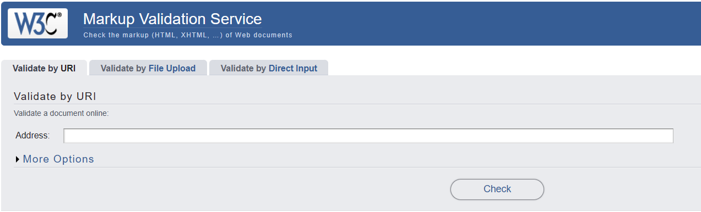
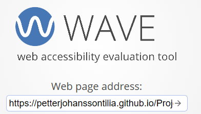
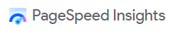
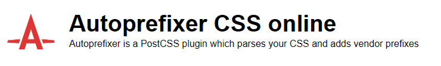

<h1>My Creators</h1>
This is a Django portfolio-project.  
The website is designed to be a place for creators to share posts with their audience. a place for regular users to be able to follow creators they like, get a personalized feed and be able to comment on their posts  
Future additions would be to implement a subscription service to financially support the creators you like

## Table of Contents

1.  

      
<a href="#ux">UX</a>

      
      

<a href="#goals">Goals</a>

    - [Visitor Goals](#visitor-goals)
    - [Business Goals](#business-goals)
    - [User Stories](#user-stories)
        

        

<a href="#visual-design">Visual Design</a>

      - [Wireframes](#wireframes)
      - [Fonts](#fonts)
      - [Icons](#icons)
      - [Colors](#colors)
      - [Images](#images)
      - [Styling](#styling)

      

    

2.  

      
<a href="#features">Features</a>

      
      

      
<a href="#page-elements">Page Elements</a>

    - [All Pages](#all-pages)
    - [Index Page](#index-page)
    - [Game Page](#gallery-page)
      

      
<a href="#feature-ideas">Feature Ideas</a>

      

3.  

      
<a href="#technologies-used">Technologies Used</a>

    - [Languages](#languages)
    - [Libraries](#libraries)
    - [Platforms](#platforms)
    - [Other Tools](#other-tools)

    

4.  

      
<a href="#testing">Testing</a>

      <ul>
      <li>

      
<a href="#methods">Methods</a>

      
      - [Validation](#validation)
      - [General Testing](#general-testing)
      - [Mobile Testing](#mobile-testing)
      - [Desktop Testing](#desktop-testing)
      
</li>
      <li>

      
<a href="#bugs">Bugs</a>

    - [Known Bugs](#known-bugs)
    - [Fixed Bugs](#fixed-bugs)
    
</li>
    </ul>
    

5.  

      
<a href="#deployment">Deployment</a>

      <ul>
      <li>

      
<a href="#local-deployment">Local Deployment</a>

      
      - [Local Preparation](#local-preparation)
      - [Local Instructions](#local-instructions)
      
</li>
      <li>

      
<a href="#github-deployment">Github Deployment</a>

      
      - [Github Preparation](#github-preparation)
      - [Github Instructions](#github-instructions)
      
</li>
      </ul>
    

6.  

      
<a href="#credit-and-contact">Credit and Contact</a>

      
      - [Content](#content)
      - [Contact](#contact)
    

---

# UX

## Goals

### Visitor Goals

The target audience for My Creators are:

- Creators that wants to share their activities with an audience.
- Users who want to find and follow new creators.
- Users who want to follow creators they already know 
- Users and creators that want to interact with their community

User goals are:

- The user quickly find new creators
- The user follows creators and personalizes their own feed
- Creators show who they are and what they do
- Creators share interesting posts
- The users and Creators interact through comments 

What weighs more fills these needs by:

- Having a clear and simple navigation bar
- A simple Creators page which lets the user sort by different creators
- A simple Feed which gets filled by the creators the user follows
- The creators gets a button on where to become a creator
- The creator gets a "My Page" menu once they've become a creator
- Each post allows for comments

### User Stories

1. As a user I can create my own account
2. As a user I can explore different creators so that I can find the ones that I like
3. As a user I can view the creators pages so that I can learn more about them
4. As a user I can follow creators so that I can curate my feed to only show the posts from the creators I'm following
5. As a user I can view posts from the creators I'm following on my feed so that I can sort with what I want to see
6. As a user I can comment on posts so that I can share my thoughts with other readers
7. As a user I can become a creator so that I can start sharing my own posts
8. As a site admin I can review, accept and decline users requests to become a creator so that I can decide which ones become creators
9. As a creator I can make my own about me page so that users can learn more about me
10. As a creator I can make my own posts so that users can read what's on my mind and what's happening with my creations

## Visual Design
My goal was to create a minimalistic website with a vibrant look to it.

### Wireframes

Index 

Creators 

About me 

Edit about me 

Post/Comment 

### Fonts

- The primary font, is sans-serif to keep it simple
- The secondary font used for the creator titles is "Rubik Mono One" from google fonts. This was to make the creator titles stand out more, make it more fun.
- the third font used was "Anton SC" from google fonts. This was to get a new and fresh Hero text that looks preofessional

### Colors

- The color scheme used on the website is different shades of pink 
- Black fonts are used to contrast the pink and white backgrounds
- A gradient background with light pastell colors was chosen to match the color scheme without taking up too much attention

### Images

- All the objects images are found on <a href="https://pixabay.com/">pixabay</a> or they have no copyright license 

### Styling

- For this project I used bootstrap for styling 
- I used bootstrap to get the website more responsive

---

# Features

## Page Elements

### Header

At the top of all pages to display the name of the game.

### Guess-boxes

#### Footer

- Located at the bottom of every page
- Displays the author of the project
- Changing shape for larger or smaller devices.

---

# Feature-Ideas

### Player feedback

The Idea of the attempts-box, score-box and the bubbles in the background is to give the
player feedback when playing. When you guess a bubble either appears or dissapears, the attempts-box changes its score and the score-box is animated to bounce and change color to grab the users attention and indicate a right or wrong guess.

# Technologies Used

## Languages

- [HTML]
  - Page markup.
- [CSS]
  - Styling and animations
- [Java-script]
  - Interactivity
- [Python]
  - Back-end
## Libraries

- [Google Fonts](https://fonts.google.com)
  - Font Styles.

## Platforms

- [Github](https://github.com/)
  - Storing code remotely and deployment.
- [Gitpod](https://gitpod.io/)
  - IDE for project development.

## Other Tools

---

# Testing

## Methods

### Validation

HTML has been validated with [W3C HTML5 Validator](https://validator.w3.org/).

|        |                                index.html                                 |                                                                game.html |
| ------ | :-----------------------------------------------------------------------: | -----------------------------------------------------------------------: |
|        |  |  |
| Alerts |                              Trailing slash                               |                                                           Trailing slash |

"Trailing slash on void elements has no effect and interacts badly with unquoted attribute values." This is from the prettier extension to make the code more readable but it has no effect on the code

HTML has been validated with [Wave.webaim HTML5 Validator](https://wave.webaim.org/).

|        |                                  index.html                                  |                                                                   game.html |
| ------ | :--------------------------------------------------------------------------: | --------------------------------------------------------------------------: |
|        |  |  |
| Alerts |                                     None                                     |                                       A paragraph is used instead of header |

Website speed optimisation has been checked with [PageSpeed Insights](https://pagespeed.web.dev/).

|                    |                                    index.html                                    |                                                                       game.html |
| ------------------ | :------------------------------------------------------------------------------: | ------------------------------------------------------------------------------: |
|                    |  |  |
| Performance issues |                                       none                                       |                                                                            none |

Javascript has been checked with [JShint](https://jshint.com/).

|          |                        |     |
| -------- | :--------------------: | --: |
| Warnings | Const and Let warnings |     |
| Errors   |          None          |     |

When using JSHint to check my JavaScript code, it doesn't recognize the const/let keywords, which is part of ES6 (ECMAScript 2015). This is because JSHint needs to be configured to understand ES6 syntax. Without this configuration, it may flag the use of const as an error, even though it's a valid feature in modern JavaScript.

CSS has been validated with [W3C CSS Validator](https://jigsaw.w3.org/css-validator/)

Results are no errors found

and auto-prefixed with [CSS Autoprefixer](https://autoprefixer.github.io/).

Links checked with [W3C Link Checker](https://validator.w3.org/checklink).

All links and anchors are working.

### General Testing

- Each time a feature was added, all the functions were tested to see if there was an impact.
- The site was sent to friends for feedback and testing.
- .gitignore file has been included to prevent system file commits.

### Manual Testing

- Testing done through going through the website both as a user, admin and no user

### Mobile Testing

- I tested the site personally on my Android device, going through the entire process, checking buttons, functions, checking out, etc. I was personally unable to test on iOS.
- The site was sent to friends and relatives for them to follow the same process. They have tested on their devices, including iOS.
- Chrome was utilised to inspect the site in mobile format, going through the pages and functions.

### Desktop Testing

- the majority of testing occurred on Chrome and Edge.
- The site was tested by friends and relatives on numerous desktop devices.
- Internet Explorer was not tested and the site was not developed with it .in mind as support for the browser is gradually being dropped.

### Testing User Stories

|     |                                           User story                                            |                                                                                                              Answer to user story |
| --- | :---------------------------------------------------------------------------------------------: | --------------------------------------------------------------------------------------------------------------------------------: |
| 1   | "As a user interested in relaxing games I'd like to be able to play without feeling any stress" |                                The game features no attempts limit or time limit. This makes the game more suited for casual play |
| 2   |                          "As a user I'd to see many different objects"                          | The game contains 4 categories and 5 objects in each category. Adding more objects to the game has been made easy by using arrays |
| 3   |               "I'd Like to get a challenge and really test my guessing abilites"                |                 With the random multiplier being added to the lowest weight target it makes for a much more complex guessing game |

## Bugs

### Known Bugs

- If you have guessed correctly 30 times in a row and all score-star spans are being showned displasyQuestion will not show a new question untill you've hiden more of the spans

### Fixed Bugs

- [negative-score-bug](https://github.com/PetterJohanssonTilia/project-2/issues/7)
  When answering incorrect with an already negative score the game would not show a new question and display errors in console
- [Readme](https://github.com/PetterJohanssonTilia/project-2/commit/53aaa8ea9d0471906e0294f3e4e879772752509c) Readme couldn't display images when they were named with uppercase .JPG and.PNG
- [UnhideScorestar](https://github.com/PetterJohanssonTilia/project-2/issues/3)
  Hiding/showing random spans instead of the already hidden/shown ones
- [Evenlistener not working](https://github.com/PetterJohanssonTilia/project-2/issues/4) Couldn't add eventlistener dynamically so instead created a new class to listen to at the start of the game
- [Multiplier Value](https://github.com/PetterJohanssonTilia/project-2/commit/85259db2acb84c6aca227400fb41c601f4dd4a47) not defined before being used

---

# Deployment

## Local Deployment

### Local Preparation

**Requirements:**
-A webbrowser of your choice, Chrome being recommended

### Local Instructions

1. Download a copy of the project repository [here](https://github.com/PetterJohanssonTilia/Project-2/archive/refs/heads/main.zip) and extract the zip file
2. Open the index.html file in your browser, This file can be dragged and droped into your browser to open it.
3. Enjoy the site!

## Github Deployment

### Github Preparation

- It is possible to copy or clone the repository to directly for deployment,
  **Requirements:**
- A free GitHub account.
- A free EmailJS account.

### Github Instructions

1. Log in to your GitHub account.
   navigate to [https://github.com/PetterJohanssonTilia/Project-1-](https://github.com/PetterJohanssonTilia/Project-1-).
1. You can set up your own repository and copy or clone it, or you fork the repository.
1. `git add`, `git commit` and `git push` to a GitHub repository, if necessary.
1. GitHub pages will update from the Main branch by default.
1. Go to the **Settings** page of the repository.
1. Scroll down to the **Github Pages** section.
1. Select the Main Branch as the source and **Confirm** the selection.
1. Wait a minute or two and it should be live for viewing.

## Credits and Contact

### Content

All the image content was from pixabay.com and all the objects and their weights was generated by chatgpt

### Contact

Please feel free to contact me at `fake.email@hotmail.com`
