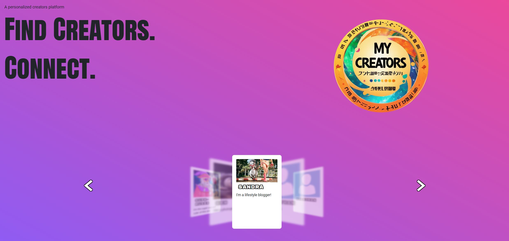
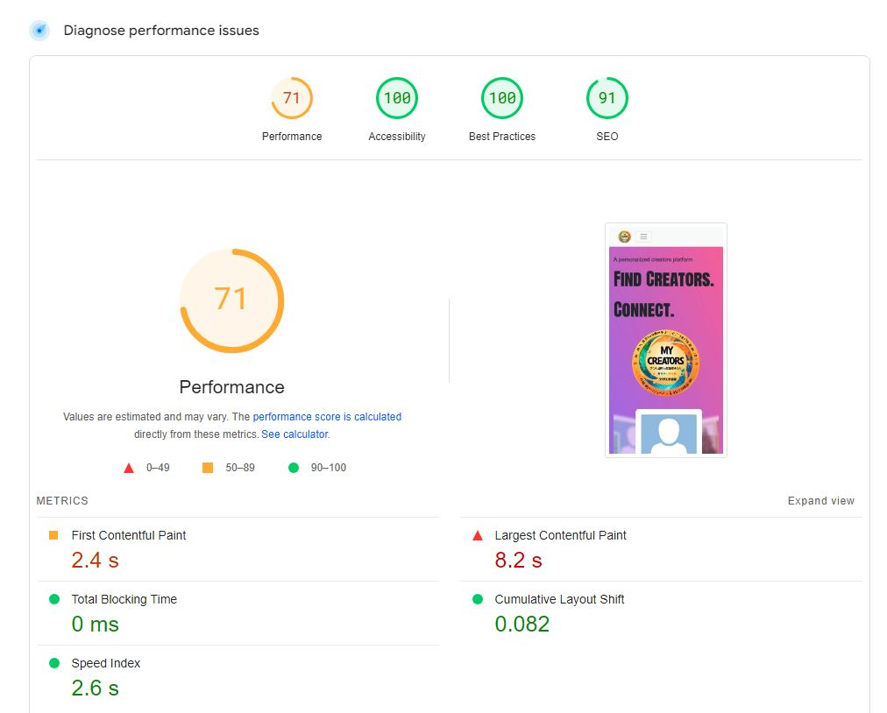

<h1>My Creators</h1>
This is a Django portfolio-project. <br>
The website is designed to be a place for creators to share posts with their audience. a place for regular users to be able to follow creators they like, get a personalized feed and be able to comment on their posts<br><br>
Future additions would be to implement a subscription service to financially support the creators you like

## Table of Contents

1.  <details open>
      <summary><a href="#ux">UX</a></summary>
      
      <details><summary><a href="#goals">Goals</a></summary>

    - [Visitor Goals](#visitor-goals)
    - [Business Goals](#business-goals)
    - [User Stories](#user-stories)
        </details>

        <details><summary><a href="#visual-design">Visual Design</a></summary>

      - [Wireframes](#wireframes)
      - [Fonts](#fonts)
      - [Icons](#icons)
      - [Colors](#colors)
      - [Images](#images)
      - [Styling](#styling)

      </details>

    </details>

2.  <details open>
      <summary><a href="#features">Features</a></summary>
      
      <details>
      <summary><a href="#page-elements">Page Elements</a></summary>

    - [All Pages](#all-pages)
    - [Index Page](#index-page)
    - [Game Page](#gallery-page)
      </details>
      <summary><a href="#feature-ideas">Feature Ideas</a></summary>
      </details>

3.  <details open>
      <summary><a href="#technologies-used">Technologies Used</a></summary>

    - [Languages](#languages)
    - [Libraries](#libraries)
    - [Platforms](#platforms)
    - [Other Tools](#other-tools)

    </details>

4.  <details open>
      <summary><a href="#testing">Testing</a></summary>
      <ul>
      <li><details>
      <summary><a href="#methods">Methods</a></summary>
      
      - [Validation](#validation)
      - [General Testing](#general-testing)
      - [Mobile Testing](#mobile-testing)
      - [Desktop Testing](#desktop-testing)
      </details></li>
      <li><details>
      <summary><a href="#bugs">Bugs</a></summary>

    - [Known Bugs](#known-bugs)
    - [Fixed Bugs](#fixed-bugs)
    </details></li>
    </ul>
    </details>

5.  <details open>
      <summary><a href="#deployment">Deployment</a></summary>
      <ul>
      <li><details>
      <summary><a href="#local-deployment">Local Deployment</a></summary>
      
      - [Local Preparation](#local-preparation)
      - [Local Instructions](#local-instructions)
      </details></li>
      <li><details>
      <summary><a href="#github-deployment">Github Deployment</a></summary>
      
      - [Github Preparation](#github-preparation)
      - [Github Instructions](#github-instructions)
      </details></li>
      </ul>
    </details>

6.  <details open>
      <summary><a href="#credit-and-contact">Credit and Contact</a></summary>
      
      - [Content](#content)
      - [Contact](#contact)
    </details>

---
## Goals

### Visitor Goals

The target audience for My Creators are:

- Creators that wants to share their activities with an audience.
- Users who want to find and follow new creators.
- Users who want to follow creators they already know 
- Users and creators that want to interact with their community

User goals are:

- The user quickly find new creators
- The user follows creators and personalizes their own feed
- Creators show who they are and what they do
- Creators share interesting posts
- The users and Creators interact through comments 

My creators fills these needs by:

- Having a clear and simple navigation bar
- A simple Creators page which lets the user sort by different creators
- A simple Feed which gets filled by the creators the user follows
- The creators gets a button on where to become a creator
- The creator gets a "My Page" menu once they've become a creator
- Each post allows for comments

### User Stories

1. As a user I can create my own account
2. As a user I can explore different creators so that I can find the ones that I like
3. As a user I can view the creators pages so that I can learn more about them
4. As a user I can follow creators so that I can curate my feed to only show the posts from the creators I'm following
5. As a user I can view posts from the creators I'm following on my feed so that I can sort with what I want to see
6. As a user I can comment on posts so that I can share my thoughts with other readers
7. As a user I can become a creator so that I can start sharing my own posts
8. As a site admin I can review, accept and decline users requests to become a creator so that I can decide which ones become creators
9. As a creator I can make my own about me page so that users can learn more about me
10. As a creator I can make my own posts so that users can read what's on my mind and what's happening with my creations

## Visual Design
My goal was to create a minimalistic website with a vibrant look to it.

### Wireframes

Index</br>


Creators</br>


About me</br>


Edit about me</br>


Post/Comment</br>


### Fonts

- The primary font, is sans-serif to keep it simple
- The secondary font used for the creator titles is "Rubik Mono One" from google fonts. This was to make the creator titles stand out more, make it more fun.
- the third font used was "Anton SC" from google fonts. This was to get a new and fresh Hero text that looks preofessional

### Colors

- The color scheme used on the website is different shades of pink 
- Black fonts are used to contrast the pink and white backgrounds
- A gradient background with light pastell colors was chosen to match the color scheme without taking up too much attention

### Images

- All the objects images are found on <a href="https://pixabay.com/">pixabay</a> or they have no copyright license 

### Styling

- For this project I used bootstrap for styling 
- I used bootstrap to get the website more responsive

---

# Features

### Models


## Page Elements

### Navbar


The Navbar is collapsible and responsive. Here a non user will only find "Creators" and "Register" buttons

A signed in user will find "Creators", "Feed" and a "Become a creator" buttons

A creator will find "Creators","Feed" and have their own "My page" dropdown menu which allows them to edit their about me information and create new Posts

### Footer

The footer only contains copyright information

### Hero Image


The hero image has a call to action text, a logo and creator-cards the user can click through, to quickly see if the users on the site interest them

### Explore Creators


This page allows the user to find new creators, see their followed creators and filter them by class.

The site staff has access to the "pending creators" tab which allows them to see all users that want to become a creator and accept/reject their request

### Feed


The Feed displays the users followed creators and the posts they've made

### Creators page


When a user clicks on a specific creator, they will see that creators page. It displays their About-Me information, their avatar and their posts.

A user can Follow/Unfollow a creator through this page

#### My-Page


If a user becomes a creator they'll get access to their own page

Here they can:
1. Upload their own avatar-picture
2. Edit their own About Me information
3. Create new posts
4. Edit and delete their old posts
5. Delete their account


# Feature-Ideas

1. Creating a comment model. Instead of saving comment information inside a JSON it'd be better to create a unique comment model for easier use and easier readabilty from the /admin page

2. Adding a payment system - To engage the users/creators a donation/subscription system should be added in the future

# Technologies Used

## Languages

- [HTML]
  - Page markup.
- [CSS]
  - Styling and animations
- [Java-script]
  - Interactivity
- [Python]
  - Back-end

## Libraries

- [Google Fonts](https://fonts.google.com)
  - Font Styles.

## Platforms

- [Github](https://github.com/)
  - Storing code remotely and deployment.
- [Gitpod](https://gitpod.io/)
  - IDE for project development.

## Databases

- SQLite 
  - Used in the development environment
- PostgresSQL
  - Used in Heroku 

---

# Testing

## Methods

### Validation

HTML has been validated with [W3C HTML5 Validator](https://validator.w3.org/).


|        |index.html                                 |                                                           
:-----------------------------------------------------------------------: | -----------------------------------------------------------------------: |
|        |  |
| Alerts |                              None                            |                                                           
Errors | The < button is being seen as an error|

The checker thinks it's an extra opening tag but it's being used as the content inside a button

|        |creators.html                                 |                                                           
:-----------------------------------------------------------------------: | -----------------------------------------------------------------------: |
|        |  |
| Alerts |                              None                            |                                                           
Errors | None|

|        |feed.html                                 |                                                           
:-----------------------------------------------------------------------: | -----------------------------------------------------------------------: |
|        |  |
| Warning |     Consider adding a lang attribute|                                                           
Errors | None|

The lang attribute is being added through base.html and on this specific page the checker couldn't find it

|        |SpecificCreator.html                                 |                                                           
:-----------------------------------------------------------------------: | -----------------------------------------------------------------------: |
|        |  |
| Warning |     None                               |                                                           
Errors | Img element missing alt, Extra p end tags|

The summernote addon is uploading pictures without ALT text and it's also adding an extra closing p tag inside the html

HTML has been validated with [Wave.webaim HTML5 Validator](https://wave.webaim.org/).


|        |index.html                                 |                                                           
:-----------------------------------------------------------------------: | -----------------------------------------------------------------------: |
|        |  |
| Alerts |                              None                            |                                                           
Errors |  Low contrast on background/text|

The error is because both the background and text is white but I've added a black border around the text to make it more visable

|        |creators.html                                 |                                                           
:-----------------------------------------------------------------------: | -----------------------------------------------------------------------: |
|        |  |
| Alerts |            Redudant links                            |                                                           
Errors |  Low contrast on background/text|

The error is because both the background and text is white but I've added a black border around the text to make it more visable
The redundant links is because the thinks all the specific user links go to the same page


Website speed optimisation has been checked with [PageSpeed Insights](https://pagespeed.web.dev/).


|        |index.html                                 |                                                           
:-----------------------------------------------------------------------: | -----------------------------------------------------------------------: |
|        |  |
| Largest contenful paint |                              User avatars                            |                                                           

The biggest slowdowns are the user avatars, they're not being compressed or using the most optimized formats      

Javascript has been checked with [JShint](https://jshint.com/).


|    Index      |                        |     |
| -------- | :--------------------: | --: |
| Warnings | None |     |
| Errors   |          None          |     |


|    Creator list     |                        |     |
| -------- | :--------------------: | --: |
| Warnings | None |     |
| Errors   |          None          |     |

CSS has been validated with [W3C CSS Validator](https://jigsaw.w3.org/css-validator/)


Results are no errors found

and auto-prefixed with [CSS Autoprefixer](https://autoprefixer.github.io/).


Links checked with [W3C Link Checker](https://validator.w3.org/checklink).


All links and anchors are working.

### General Testing

- Each time a feature was added, all the functions were tested to see if there was an impact.
- The site was sent to friends for feedback and testing.
- .gitignore file has been included to prevent system file commits.

### Manual Testing

- Testing done through going through the website both as a user, admin and no user

### Mobile Testing

- I tested the site personally on my Android device, going through the entire process, checking buttons, functions, checking out, etc. I was personally unable to test on iOS.
- The site was sent to friends and relatives for them to follow the same process. They have tested on their devices, including iOS.
- Chrome was utilised to inspect the site in mobile format, going through the pages and functions.

### Desktop Testing

- the majority of testing occurred on Chrome and Edge.
- The site was tested by friends and relatives on numerous desktop devices.
- Internet Explorer was not tested and the site was not developed with it .in mind as support for the browser is gradually being dropped.

### Testing User Stories
1. As a user I can create my own account
2. As a user I can explore different creators so that I can find the ones that I like
3. As a user I can view the creators pages so that I can learn more about them
4. As a user I can follow creators so that I can curate my feed to only show the posts from the creators I'm following
5. As a user I can view posts from the creators I'm following on my feed so that I can sort with what I want to see
6. As a user I can comment on posts so that I can share my thoughts with other readers
7. As a user I can become a creator so that I can start sharing my own posts
8. As a site admin I can review, accept and decline users requests to become a creator so that I can decide which ones become creators
9. As a creator I can make my own about me page so that users can learn more about me
10. As a creator I can make my own posts so that users can read what's on my mind and what's happening with my creations

|     |                                           User story                                            |                                                                                                              Answer to user story |
| --- | :---------------------------------------------------------------------------------------------: | --------------------------------------------------------------------------------------------------------------------------------: |
| 1   | "As a user I can create my own account" | The user can click on the create account button and register, login and logout from their account|
| 2   | "As a user I can explore different creators so that I can find the ones that I like" | TUsers can use the search bar to find specific creators or use tags to filter creators in the "Explore Creators" section |
| 3   |  "As a user I can view the creators pages so that I can learn more about them" | The user can click on a creator to see their about me page with relevant information and their posts |
| 4   | "As a user I can follow creators so that I can curate my feed to only show the posts from the creators I'm following"  | The user can follow/unfollow with the click of a button found on the users about me page |
| 5   | "As a user I can view posts from the creators I'm following on my feed so that I can sort what I want to see" | The user can see posts from their followed creators on their "Feed" tab |
| 6   | "As a user I can comment on posts so that I can share my thoughts with other readers" |The user can click on any specific post and leave a comment and choose to delete their comment |
| 7   | "As a user I can become a creator so that I can start sharing my own posts"   |   The user can click the "become a creator" button and enter which type of creator along with why they should be allowed to become a creator |
| 8   |" As a site admin I can review, accept and decline users requests to become a creator so that I can decide which ones become creators"  | The Staff can see users with a creator pending status and see what type of creator along with why they should become a creator information and click the accept or reject button |
| 9   | "As a creator I can make my own about me page so that users can learn more about me" | The user can create about me information along with uploading their own avatar |
| 10   |  "As a creator I can make my own posts so that users can read what's on my mind and what's happening with my creations
"  | The user can write posts that also allows for uploading images, they can also decide to delete or edit their posts |

## Fixed Bugs

Can all be found here : https://github.com/PetterJohanssonTilia/MyCreators/issues?q=is%3Aissue+is%3Aclosed

- can't see pending creators on heroku but can see it in dev environment bug
- Summernote creates html bug
- creator cards gets squished when only a few are showing bug
- users that doesn't click "become a creator" can't use the creators_list.html
- can't press unfollow
- user comments not displaying date
- creators without the status of ACCEPTED shown in the creators list bug
- pending creators not seen as admin
- TypeError when pressing log out bug
- Can't get {{ status }} in base.html bug
- NoReverseMatch at /post/create/ bug
- CKEDITOR returning htm Redirect for follow/unfollow "NoReverseMatch at /follow/1/" bugl instead of text when viewing the posts
- Redirect for follow/unfollow "NoReverseMatch at /follow/1/"
- about me in navbar page 404
- Circular import bug

### Known Bugs

- Pictures to big from user posts - If the user posts a big enough picture the edit/delete button on their posts gets pushed down and can't be clicked

# Deployment

### Heroku Deployment
This project uses Heroku, a platform as a service (PaaS) that enables developers to build, run, and operate applications entirely in the cloud.

Deployment steps are as follows, after account setup:

Select New in the top-right corner of your Heroku Dashboard, and select Create new app from the dropdown menu.
Your app name must be unique, and then choose a region closest to you (EU or USA), and finally, select Create App.
From the new app Settings, click Reveal Config Vars, and set your environment variables.

| Key  |Value|                                                           
:------: | -------: |
| DATABASE_URL |   user's own value   |
| IP |   0.0.0.0  |   
| Database_name |  user's own value   |   
| Database_URI |   user's own value   |   
| PORT | 5000   |   
| SECRET_KEY |  user's own value   |      

Heroku needs two additional files in order to deploy properly.

requirements.txt
Procfile
You can install this project's requirements (where applicable) using:

```pip3 install -r requirements.txt```
If you have your own packages that have been installed, then the requirements file needs updated using:

```pip3 freeze --local > requirements.txt```
The Procfile can be created with the following command:

```echo web: python app.py > Procfile```
replace app.py with the name of your primary Flask app name; the one at the root-level
For Heroku deployment, follow these steps to connect your own GitHub repository to the newly created app:

Either:

Select Automatic Deployment from the Heroku app.

Or:

In the Terminal/CLI, connect to Heroku using this command: ```heroku login -i```
Set the remote for Heroku: ```heroku git:remote -a app_name``` (replace app_name with your app name)
After performing the standard Git add, commit, and push to GitHub, you can now type:
```git push heroku main```
The project should now be connected and deployed to Heroku!

### Local Deployment
This project can be cloned or forked in order to make a local copy on your own system.

For either method, you will need to install any applicable packages found within the requirements.txt file.

```pip3 install -r requirements.txt.```
If you are using SQLAlchemy for your project, you need to create a local PostgreSQL database. In this example, the example database name is db-name.


```workspace (branch) $ set_pg
workspace (branch) $ psql

... connection to postgres ...

postgres=# CREATE DATABASE db-name;
CREATE DATABASE
postgres=# \c db-name;
You are now connected to database "db-name" as user "foobar".
db-name=# \q
```
Once that database is created, you must migrate the database changes from your models.py file. This example uses app-name for the name of the primary Flask application.

``` workspace (branch) $ python3

... connection to Python CLI ...

>>> from app-name import db
>>> db.create_all()
>>> exit()
To confirm that the database table(s) have been created, you can use the following:

workspace (branch) $ psql -d db-name

... connection to postgres ...

postgres=# \dt

	List of relations
Schema | Name | Type | Owner
-------+------+------+--------
public | blah1 | table | foobar
public | blah2 | table | foobar
public | blah3 | table | foobar

db-name=# \q
```

You will need to create a new file called env.py at the root-level, and include the same environment variables listed above from the Heroku deployment steps, plus a few extras.

Sample env.py file:

``` import os

os.environ.setdefault("IP", "0.0.0.0")
os.environ.setdefault("MONGO_DBNAME", "user's own value")
os.environ.setdefault("MONGO_URI", "user's own value")
os.environ.setdefault("PORT", "5000")
os.environ.setdefault("SECRET_KEY", "user's own value")

# local environment only (do not include these in production/deployment!)
os.environ.setdefault("DB_URL", "user's own value")
os.environ.setdefault("DEBUG", "True")
os.environ.setdefault("DEVELOPMENT", "True")
```
If using Flask-Migrate, make sure to include the following steps as well.

``` pip3 install Flask-Migrate```
Import the newly installed package on your main __init__.py file:
  * from flask_migrate import Migrate

Define Migrate in the same file after app and db are defined:
  * migrate = Migrate(app, db)

Initiate the migration changes in the terminal:

``` workspace (branch) $ flask db init

	... generating migrations ...

workspace (branch) $ set_pg
workspace (branch) $ flask db migrate -m "Add a commit message for this migration"

	... migrating changes ...

workspace (branch) $ flask db upgrade

	... updating database ...
```

### Cloning
You can clone the repository by following these steps:

1. Go to the GitHub repository
2. Locate the Code button above the list of files and click it
3. Select if you prefer to clone using HTTPS, SSH, or GitHub CLI and click the copy button to copy the URL to your clipboard
4. Open Git shell or Terminal
5. Change the current working directory to the one where you want the cloned directory
6. In your IDE Terminal, type the following command to clone my repository:
git clone https://github.com/rhysbobbett/gardenmaintenance.git
7. Press Enter to create your local clone.

Alternatively, if using Gitpod, you can click below to create your own workspace using this repository.

Open in Gitpod

Please note that in order to directly open the project in Gitpod, you need to have the browser extension installed. A tutorial on how to do that can be found here.

### Forking

By forking the GitHub Repository, we make a copy of the original repository on our GitHub account to view and/or make changes without affecting the original owner's repository. You can fork this repository by using the following steps:

Log in to GitHub and locate the GitHub Repository
At the top of the Repository (not top of page) just above the "Settings" Button on the menu, locate the "Fork" Button.
Once clicked, you should now have a copy of the original repository in your own GitHub account!


## Credits and Contact
 The code for the item-cards on the front page was made by Lun Dev
 - https://www.lundevweb.com/2023/02/animation-card-slider-in-html-css.html

### Content

All the image content was from pixabay.com and all the users information was created with chatGPT

The main background was taken from google:

https://external-content.duckduckgo.com/iu/?u=https%3A%2F%2Fstatic.vecteezy.com%2Fsystem%2Fresources%2Fpreviews%2F007%2F188%2F453%2Foriginal%2Fabstract-blur-background-with-pastel-color-free-vector.jpg&f=1&nofb=1&ipt=618c7fb3d99f2e37abc52c4c583f2af2be26e9a579c44f224219700d4e1b38c5&ipo=images

### Contact

Please feel free to contact me at `fake.email@hotmail.com`
